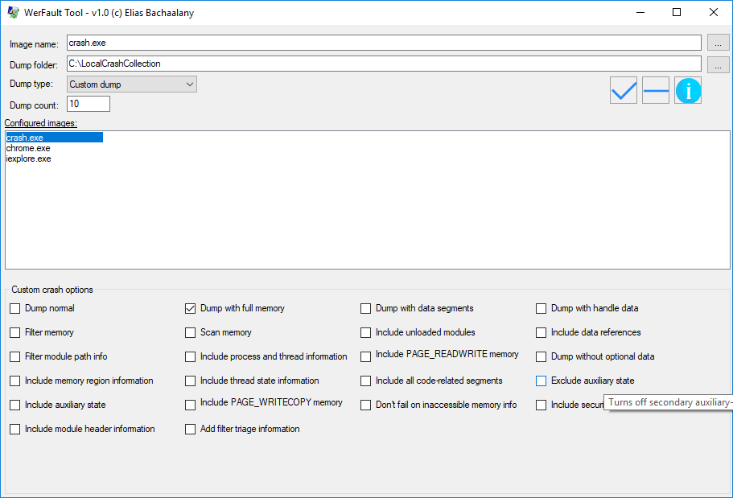

# WerFault GUI tool

This is a simple tool that allows you to configure WerFault so it collects crash dumps of processes and store them locally.

Please refer to http://lallouslab.net/2018/06/13/windows-error-report-local-crash-dump-collection-graphical-tool/ and https://msdn.microsoft.com/en-us/library/windows/desktop/bb787181(v=vs.85).aspx

